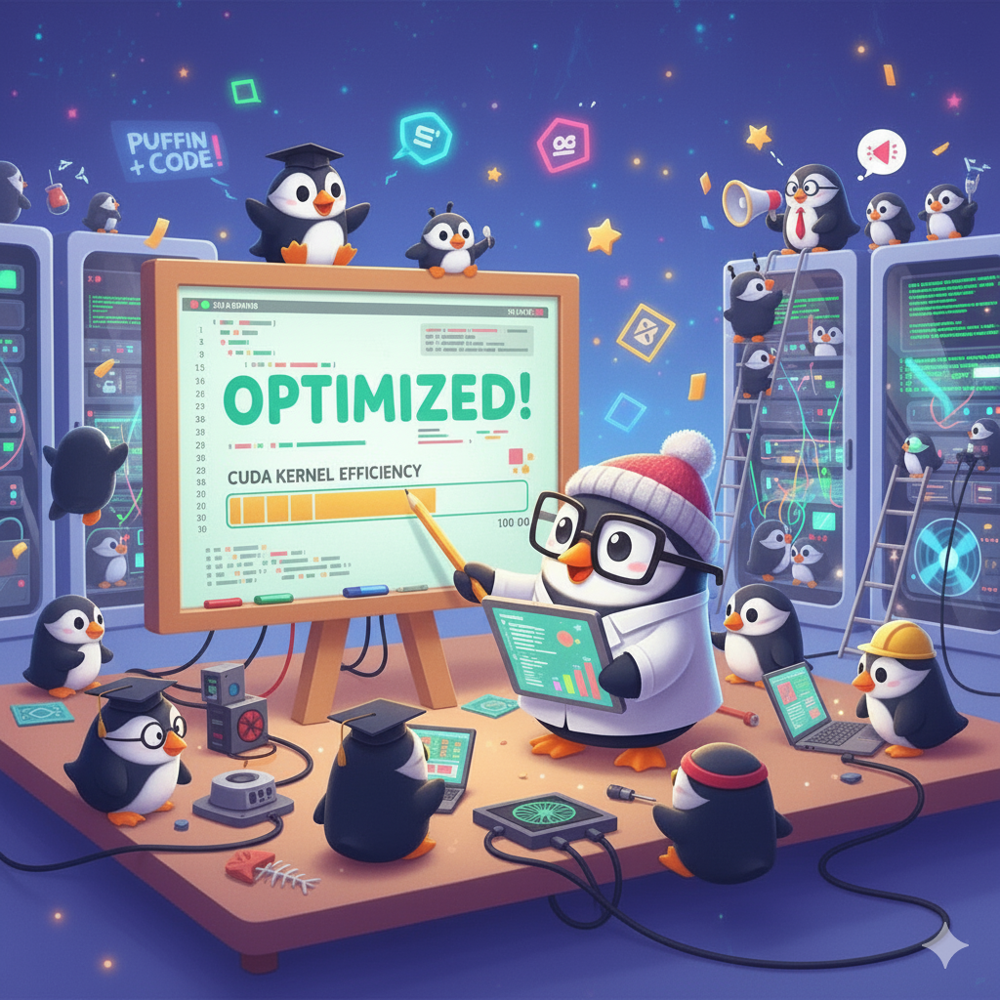
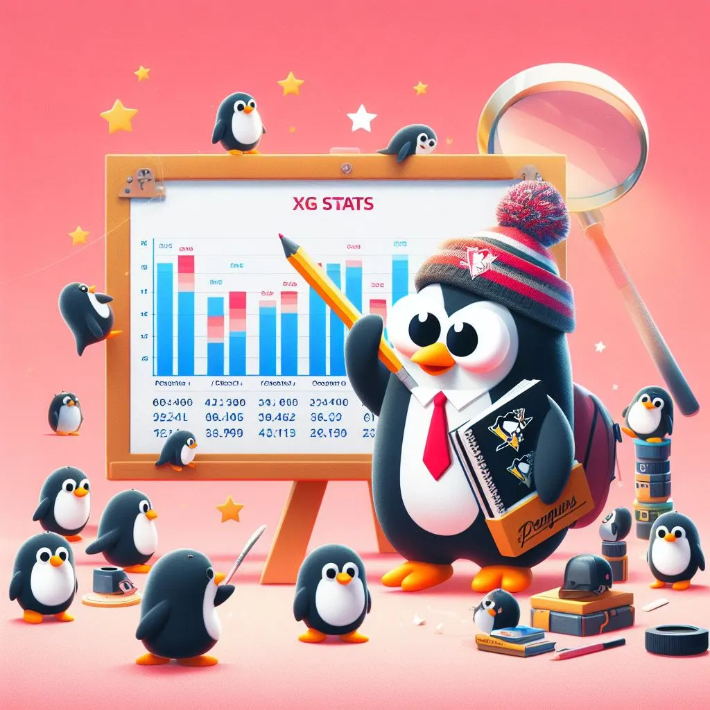

## Hi there, I'm Alexander!

As a Computational Geophysics PhD, I specialize in applying machine learning and GPU acceleration to solve real-world problems. I’ve been able to take my academic research from UT Austin and turn it into innovative systems for the energy and transportation sectors.

## My Current Projects

### CUDA Kernel Optimization for Image Convolution 

This is a personal study project inspired by Simon Boehm's work on optimizing CUDA Matmul Kernels. My goal is to develop a basic image convolution CUDA kernel and enhance it through an iterative process of optimization techniques.

The project's primary objective is to achieve a level of performance comparable to the industry-standard nppiFilter_8u_C1R function from the NVIDIA Performance Primitives (NPP) library, which will serve as my benchmark for all performance comparisons.

### NHL Data Science Projects

In this collection of data science projects, I analyze NHL statistics to naively make some predictions.

## Let's Connect

Feel free to reach out to me to chat about GPU computing, machine learning, or ice hockey!
